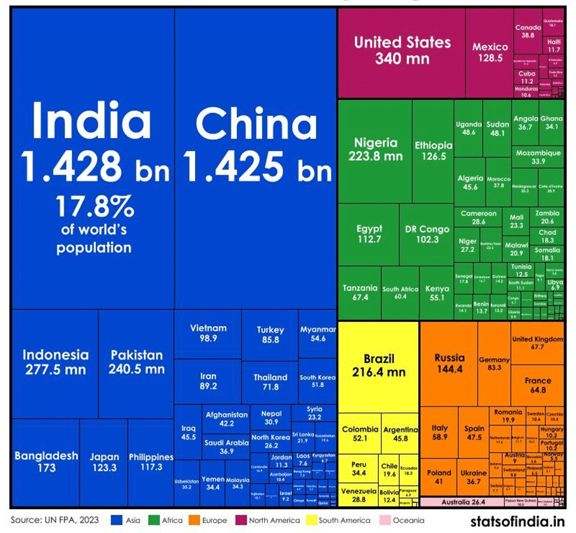

# Data Visualization

## Assignment 2: Good and Bad Data Visualization

### Requirements:

- Data visualizations are important tools for communication and convincing; we need to be able to evaluate the ways that data are presented in visual form to be critical consumers of information 
- To test your evaluation skills, locate two public data visualizations online, one good and one bad  
    - You can find data visualizations at https://public.tableau.com/app/discover or https://datavizproject.com/, or anywhere else you like! 
- For each visualization (good and bad):  
    - Explain (with reference to material covered up to date, along with readings and other scholarly sources, as needed) why you classified that visualization the way you did.
      ```
      Your answer...
One of the worst examples of data visualisation for me would be this one:

https://5cc2b83c.delivery.rocketcdn.me/app/uploads/bad-data-visualisation-treemap.png


It's not logical, confusing, the visualization is redundant—while the treemap groups data visually, it still includes values that are hard to read, especially in the bottom-right corner, making them ineffective. Moreover, the continents aren’t arranged according to treemap logic, which subtly disrupts clarity.
The color scheme is overly bright, making the visualization hard to read and distracting from the actual data;


      ```
    - How could this data visualization have been improved?  
      ```
      To improve this visualization:

Color Scheme: Use a more subdued, balanced palette for clarity.

Text Readability: Increase font size and improve placement to avoid illegibility.

Eliminate numeric values on the map and rely on area size to represent data.

Grouping: Organize countries by continent and use consistent color coding.

Labeling: Use larger, clearer labels for smaller countries.


These changes would enhance clarity, ease of use, and effectiveness.


Good data visualisation:
Found https://ourworldindata.org/life-expectancy as an example ( the website contains a lot of good data visualization sources;)

The "Global Life Expectancy" visualization from Our World in Data is great for a few reasons:

Clear and Easy to Read: It's super straightforward to understand. You can easily see how life expectancy differs across countries, thanks to clear labels and a simple layout.

Color Coding: The use of colors (like red for low life expectancy and blue for high) helps you quickly spot patterns. It makes the whole thing much more intuitive.

Interactive: You can hover over any country to see exact numbers, which makes it way more fun and allows you to dive deeper if you're curious.

Context: It gives you a timeline, so you can see how life expectancy has changed over the years. 

Simple Design: There's no extra clutter. The focus is on the data, which makes it easier to follow.

In short, it's a great visualization because it’s easy to understand, looks good, and lets you interact with the data in a meaningful way.

      
      ```
- Word count should not exceed (as a maximum) 500 words for each visualization (i.e. 
300 words for your good example and 500 for your bad example)

### Why am I doing this assignment?:

- This assignment ensures active participation in the course, and assesses the learning outcomes
* Apply general design principles to create accessible and equitable data visualizations
* Use data visualization to tell a story

### Rubric:

| Component               | Scoring   | Requirement                                                 |
|-------------------------|-----------|-------------------------------------------------------------|
| Data viz classification and justification | Complete/Incomplete | - Data viz are clearly classified as good or bad<br />- At least three reasons for each classification are provided<br />- Reasoning is supported by course content or scholarly sources |
| Suggested improvements  | Complete/Incomplete | - At least two suggestions for improvement<br />- Suggestions are supported by course content or scholarly sources |

## Submission Information

🚨 **Please review our [Assignment Submission Guide](https://github.com/UofT-DSI/onboarding/blob/main/onboarding_documents/submissions.md)** 🚨 for detailed instructions on how to format, branch, and submit your work. Following these guidelines is crucial for your submissions to be evaluated correctly.

### Submission Parameters:
* Submission Due Date: `23:59 - 06/07/2025`
* The branch name for your repo should be: `assignment-2`
* What to submit for this assignment:
    * This markdown file (assignment_2.md) should be populated and should be the only change in your pull request.
* What the pull request link should look like for this assignment: `https://github.com/<your_github_username>/visualization/pull/<pr_id>`
    * Open a private window in your browser. Copy and paste the link to your pull request into the address bar. Make sure you can see your pull request properly. This helps the technical facilitator and learning support staff review your submission easily.

Checklist:
- [ ] Create a branch called `assignment-2`.
- [ ] Ensure that the repository is public.
- [ ] Review [the PR description guidelines](https://github.com/UofT-DSI/onboarding/blob/main/onboarding_documents/submissions.md#guidelines-for-pull-request-descriptions) and adhere to them.
- [ ] Verify that the link is accessible in a private browser window.

If you encounter any difficulties or have questions, please don't hesitate to reach out to our team via our Slack. Our Technical Facilitators and Learning Support staff are here to help you navigate any challenges.
